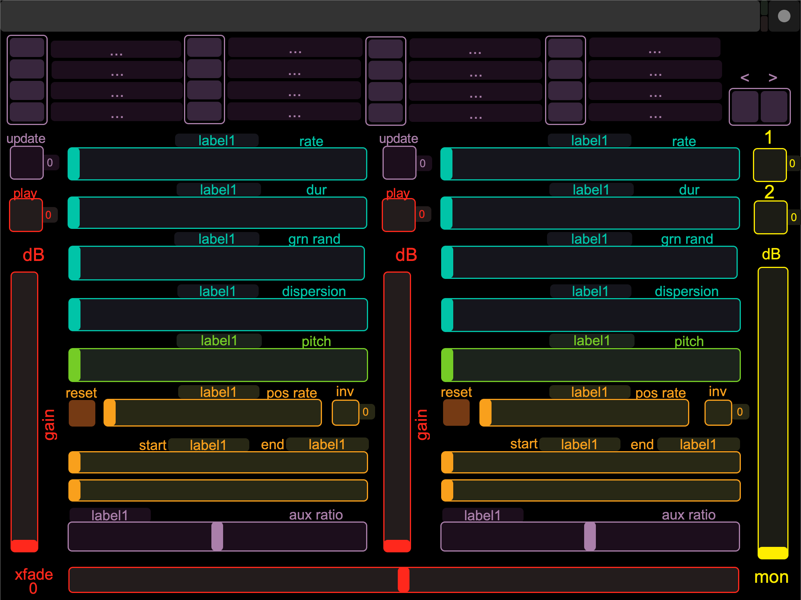

# GrainFader

### A pair of buffer granulators that can be crossfaded and independently monitored, with optional TouchOSC integration.

*The TouchOSC template for GrainFader. Labels are populated with current values as controls change.*

### Overview
- `GrainFader` wraps up two instances of `GrainBufJ` (part of JoshUGens in
[sc3-plugins](https://github.com/supercollider/sc3-plugins)) and index into soundfile buffers using a `Phasor` of variable speed and direction (< 0 >).
- You supply a file path of a folder containing soundfiles and they are all
loaded for swapping on the fly.
- The two granulators are summed into a mono feed via a power-panning crossfade.
- Each feed can be monitored individually via two monitor busses, independent
of the main output bus. Each grain stream can also be sent to an auxilliary bus,
such as a effects/reverb send.

### Installation

Open up SuperCollider and evaluate the following line of code:
`Quarks.install("https://github.com/mtmccrea/grainfader.quark")`

Installing this quark will also install Ctk and TouchOSC.

### Contributors

- Michael McCrea @mtmccrea
- Marcin Pączkowski @dyfer
- The `GrainBufJ` UGen was written by Joshua Parmenter @joshpar
